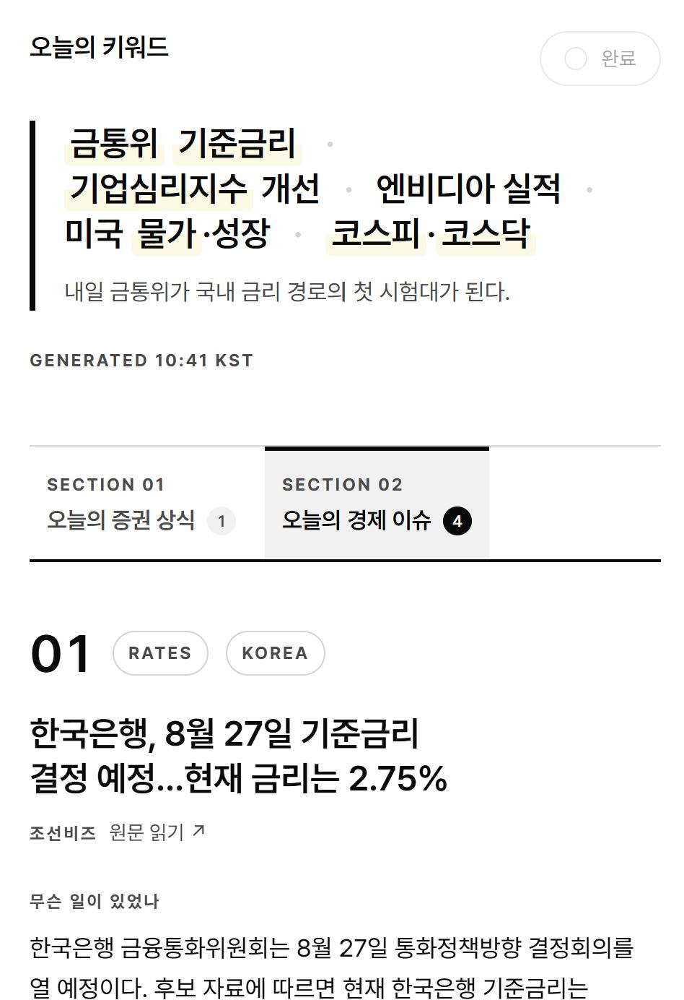
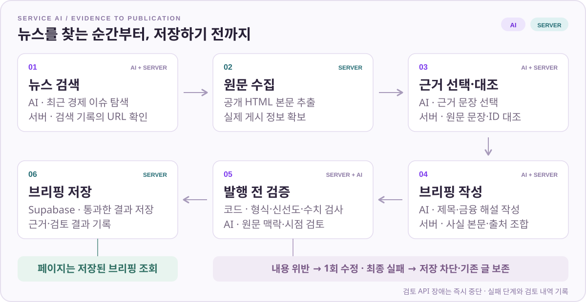
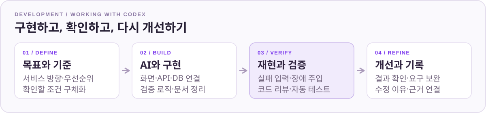

  

    <strong>AI와 함께, 화면부터 백엔드·검증 흐름까지 구현하는 개인 프로젝트.</strong> 
    서비스의 목표와 우선순위를 정하고, AI(Codex)와 UI·API·DB를 연결합니다. 
    코드 리뷰·오류 재현·자동 테스트 결과를 확인하며 개선합니다.
  

   

  

    
    
    
    
    
  

  

    <a href="https://dailyticknews.vercel.app/"><strong>서비스 둘러보기 ↗</strong></a>
    &nbsp; · &nbsp;
    <a href="#ai-pipeline"><strong>AI 생성 구조</strong></a>
    &nbsp; · &nbsp;
    <a href="./docs/TECHNICAL.md"><strong>개발·운영 가이드</strong></a>
  

 

## 01 / 매일 아침, 금융을 읽는 습관

**DAILY TICK**은 증권사·금융권에 관심 있는 사람을 위한 데일리 금융 학습 서비스입니다.
경제 이슈를 읽고, 금융 개념을 익히고, 오늘 배운 내용을 기록합니다.

- 📰 **Daily News** — 주요 경제 이슈와 시장 영향 해설
- 📖 **Finance Curriculum** — 91개 금융 개념을 발행 이력에 따라 순서대로 학습·복습
- ✍️ **Learning Log** — 날짜별 학습 완료 체크, 메모, 지난 브리핑 아카이브

<strong>서비스 화면 펼쳐보기</strong>

   
  과거 발행분 화면 예시 · 반응형 지면 · PWA 지원

 

## 02 / 서비스 속 AI

**검색 → 근거 선택 → 작성 → 의미 검토**를 별도의 AI 호출로 나누고,
서버가 그 사이에서 원문·출처·발행 조건을 확인합니다.

  

**사실 본문은 서버가 검증된 원문 문장으로 조합**하고, AI는 제목과 금융 해설을 작성합니다.
매일 예약 작업으로 미리 생성해 두어, 페이지에서는 AI 호출 없이 저장된 브리핑을 읽습니다.

- **출처·근거** — 실제 검색 기록의 URL, 수집한 본문의 근거 문장·ID를 대조합니다. [검색 기록 ↗](./src/lib/news/search-provenance.ts) · [원문 조합 ↗](./src/lib/briefing/materialize.ts)
- **형식·신선도·수치** — Zod 스키마, 게시 시각 범위, 뉴스 제목·해설에 추가된 숫자를 검사합니다. [코드 ↗](./src/lib/briefing/verify.ts)
- **의미·실패 처리** — 별도 AI 호출로 원문 맥락·시점을 검토하고, 거절·검토 누락·중복·API 장애를 처리합니다. [코드 ↗](./src/lib/openai/generate-briefing.ts)

> 내용 검증 위반은 **1회 수정 재시도**합니다. 검토 API 장애나 최종 실패 시 저장을 차단하고 기존 브리핑을 보존합니다.

 

## 03 / AI와 함께 개발하고 검증하는 방식

서비스 기획부터 화면·서버 API·데이터 저장·발행 로직까지 AI 코딩 도구와 함께 작업합니다.
구현 후에는 실패 상황을 재현하고, 확인한 결과를 다음 수정과 문서에 연결합니다.

  

**실패 입력을 넣어 확인한 동작**

| 넣어 본 상황 | 확인한 결과 | 테스트 |
| :--- | :--- | :---: |
| 모델이 검색 기록에 없는 URL을 추가 | 해당 출처를 후보에서 제거 | [↗](./tests/search-provenance.test.ts) |
| AI가 원문에 없는 문장·숫자를 근거로 선택 | 해당 뉴스 후보 제외 | [↗](./tests/ground-news.test.ts) |
| 근거에 없는 “표결은 7대0”을 해설에 추가 | AI 의미 검토 전에 코드에서 차단 | [↗](./tests/generate-grounded.test.ts) |
| 검토 결과 누락·중복 또는 검토 API 장애 | 통과로 처리하지 않고 검증 실패 | [↗](./tests/generate-grounded.test.ts) |
| AI 검토가 근거 부족으로 거절 | DB 저장 없이 실패·검토 내역 기록 | [↗](./tests/briefing-pipeline.test.ts) |

  
  2026-10-10 · npm test · 날짜·커리큘럼·생성 흐름 포함

테스트는 외부 AI·네트워크·DB를 대체해 **코드가 잘못된 입력과 실패 응답을 처리하는지** 확인합니다.
AI 의미 검토의 실제 오류 탐지율과 뉴스 정확도는 별도 평가 대상입니다.

[검증 상세·협업 사례](./docs/TECHNICAL.md#ai와-어떻게-협업하나요) · [근거 검증을 강화한 변경 이력](https://github.com/xxj15/dailytick/compare/786e739...44b3f21)

 

<strong>🛠️ 실행 방법과 기술 문서</strong>

Node.js 22.15 이상에서 `npm ci`로 설치하고, `.env.example`을 `.env.local`로 복사해 설정합니다.
DB 스키마 적용 후 `npm run dev`로 실행합니다.

[개발·운영 가이드](./docs/TECHNICAL.md) · [환경변수](./.env.example) · [DB 스키마](./supabase/schema.sql)

 

개인 금융 학습용 프로젝트 · 상업적 이용 X

